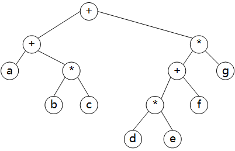

# 树

## 树的实现

```C++
typedef struct TreeNode *PtrToNode;
struct TreeNode
{
    ElementType Element;
    PtrToNode   FirstChild;
    PtrToNode   NextSibling;
};
```

### 树的遍历

#### 先序遍历--preorder traversal

在先序遍历中，对节点的处理工作是在它的诸儿子节点被处理之前进行的。

#### 后序遍历--postorder traversal

在后序遍历中，对节点的处理工作是在它的诸儿子节点被计算后进行的。

-----------

## 二叉树 -- binary tree

> 二叉树是一棵树，其中每个节点都不能多于二个的儿子。

### 实现

```C++
typedef struct TreeNode *PtrToNode;
typedef struct PtrToNode Tree;
struct TreeNode
{
    ElementType Element;
    Tree        Left;
    Tree        Right;
};
```

### 二叉树的遍历

#### 表达式树(expression-tree)



#### 中序遍历 -- inorder traversal

先访问左子树，然后根节点，最后右子树。

> 得到：`(a+b*c) + ((d*e + f)*g)`

#### 后序遍历 -- postorder traversal

先访问左子树，然后右子树，最后根节点。

> 得到： `abc+ + de*f + g* +`

#### 先序遍历 -- preorder traversal

先访问根节点，然后遍历左子树，最后遍历右子树。在遍历左右子树的时候，仍先访问根节点。记为：**根左右**

> 得到：`+ +a*bc* + *defg`

---------

## 二叉查找树 

使一个二叉树成为二叉查找树的性质是：对于树中的每个节点`X`，它的**左子树**中所有关键字的值**小于**`X`的关键字的值，而它的**右子树**中所有关键字的值**大于**`X`的关键字的值。

> 这里我们假设树中每个节点被指定一个关键字的值。 

### MakeEmpty

> 这个操作主要用于初始化。

```C++
struct TreeNode;
typedef struct TreeNode *Position;
typedef struct TreeNode *SearchTree;

/* Place in the implement file */
struct TreeNode
{
    ElementType Element;
    SearchTree  Left;
    SearchTree  Right;
};

//MakeEmpty

SearchTree MakeEmpty (SearchTree T)
{
    if (T != NULL)
    {
        MakeEmpty(T->Left);
        MakeEmpty(T->Right);
    }
    return NULL;
}
```

> 这种实现紧密地遵循树的**递归**定义。

### Find

> 这个操作一般返回指向树`T`中具有关键字`X`的节点的指针，如果不存在，返回`NULL`。

1. 如果 `T` 是 `NULL`，就可以直接返回 `NULL`

2. 如果存储在`T`内的关键字是`X`，则返回 `T`

3. 否则，我们对左子树或右子树进行一次递归调用。

```C++
Position Find(ElementType X, SearchTree T)
{
    if (T == NULL)
        return NULL;
    if (X < T->Element)
        return Find(X, T->Left);
    else if (X > T->Element)
        return Find(X, T->Right);
    else
        Return T;
}
```

### FindMin / FindMax

```C++
        Position FindMin( SearchTree T )
        {
            if( T == NULL )
                return NULL;
            else
            if( T->Left == NULL )
                return T;
            else
                return FindMin( T->Left );
        }

        Position FindMax( SearchTree T )
        {
            if( T != NULL )
                while( T->Right != NULL )
                    T = T->Right;

            return T;
        }
```

### Insert

> 我们设计成一个返回指向新树`根`的指针。

1. 为了将`X`插入树中，我们像用`Find`那样沿着树查找
2. 如果找到了`X`，则什么也不做（或进行一些更新）
3. 否则，将`X`插入到遍历的路径上的最后一点上

```C++
        SearchTree Insert( ElementType X, SearchTree T )
        {
/* 1*/      if( T == NULL )
            {
                /* Create and return a one-node tree */
/* 2*/          T = malloc( sizeof( struct TreeNode ) );
/* 3*/          if( T == NULL )
/* 4*/              FatalError( "Out of space!!!" );
                else
                {
/* 5*/              T->Element = X;
/* 6*/              T->Left = T->Right = NULL;
                }
            }
            else
/* 7*/      if( X < T->Element )
/* 8*/          T->Left = Insert( X, T->Left );
            else
/* 9*/      if( X > T->Element )
/*10*/          T->Right = Insert( X, T->Right );
            /* Else X is in the tree already; we'll do nothing */

/*11*/      return T;  /* Do not forget this line!! */
        }
```

### Delete

1. 如果节点是一片叶子，可以立即被删除
2. 如果节点有一个儿子，可以在该节点的父节点处，调整指针**绕过**该节点后被删除
3. 如果节点有两个儿子，一般的删除策略是用其右子树**最小的数据**代替该节点的数据，并递归地删除那个系欸按。

```C++
        SearchTree Delete( ElementType X, SearchTree T )
        {
            Position TmpCell;

            if( T == NULL )
                Error( "Element not found" );
            else
            if( X < T->Element )  /* Go left */
                T->Left = Delete( X, T->Left );
            else
            if( X > T->Element )  /* Go right */
                T->Right = Delete( X, T->Right );
            else  /* Found element to be deleted */
            if( T->Left && T->Right )  /* Two children */
            {
                /* Replace with smallest in right subtree */
                TmpCell = FindMin( T->Right );
                T->Element = TmpCell->Element;
                T->Right = Delete( T->Element, T->Right );
            }
            else  /* One or zero children */
            {
                TmpCell = T;
                if( T->Left == NULL ) /* Also handles 0 children */
                    T = T->Right;
                else if( T->Right == NULL )
                    T = T->Left;
                free( TmpCell );
            }

            return T;
        }
```

> 历程所完成的删除操作，效率并不高。如果删除的次数不多，则通常使用的策略是**懒惰删除**(`lazy deletion`)： 当一个元素要被删除时，它仍留在树中，只做一个被删除的记号。 

## AVL树

`AVL(Adelson-Velskii and Landis)`树是带有**平衡条件的**二叉**查找树**。

> 这个平衡条件必须容易保持，并且它需保证树的深度是`O(log N)`。最简单的想法是要求左右子树具有相同的高度。

> 另一种平衡条件是，要求是要求每个节点都必须要有相同高度的左子树和右子树。


## B-树 (B-tree)

> 这种树也是一种常用的查找树，不是二叉树。

阶为`M`的`B-tree`具有下列结构特性：

+ 树的根或者是一片树叶，或者其儿子数在`2`和`M`之间

+ 除根外，所有非树叶节点的儿子数在`[M/2]`和`M`之间

+ 所有的树叶都在相同深度上