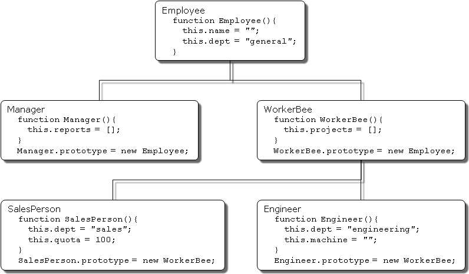
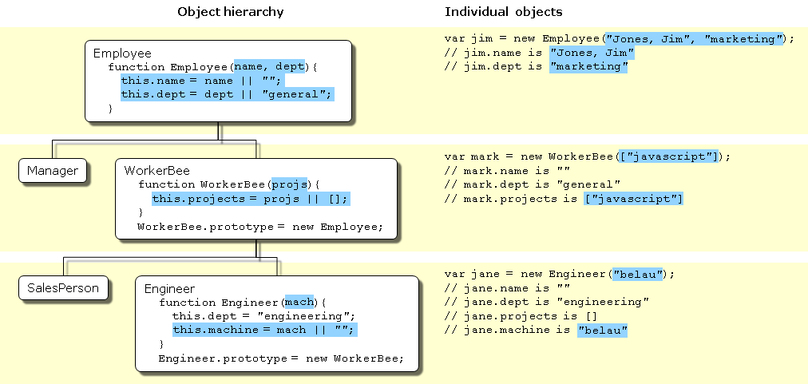

# Object model

`JavaScript`是一种基于**原型**的面向对象的语言，而不是基于类的。

## 基于类 vs 基于原型

基于类的面向对象的语言，是构建在两个不同实体的概念之上的：**类和实例**

基于原型的语言不存在这种区别：**只有对象**。基于原型的语言具有所谓原型对象`rototypical object`的概念。原型对象可以作为一个模板，新对象可以从中获得原始的属性。任何对象都可以指定其自身的属性，既可以是创建时也可以在运行时创建。而且，任何对象都可以作为另一个对象的原型`prototype`，从而允许后者共享前者的属性。

### 定义

在基于类的语言中，需要专门的类定义符`class definition`定义类。

`JavaScript`也遵循类似的模型，但却不同于基于类的语言。在`JavaScript`中你只需要定义构造函数来创建具有一组特定的初始属性和属性值的对象。任何`JavaScript`函数都可以用作构造器。 也可以使用`new`操作符和构造函数来创建一个新对象。

### 子类与继承

基于类的语言是通过对类的定义中构建类的层级结构的。

`JavaScript`通过将构造器函数与原型对象相关联的方式来实现继承。

### 添加和移除属性

基于类的语言中，通常在编译时创建类，然后在编译时或者运行时对类的实例进行实例化。一旦定义了类，无法对类的属性进行更改。

在`JavaScript`中，允许运行时添加或者移除任何对象的属性。如果您为一个对象中添加了一个属性，而这个对象又作为其它对象的原型，则以该对象作为原型的所有其它对象也将获得该属性。

---

## 例子


+ `Employee`具有`name`属性（默认值为空的字符串）和`dept`属性（默认值为`general`）
+ `Manager`是`Employee`的子类。它添加了`reports`属性（默认值为空的数组，以`Employee`对象数组作为它的值）
+ `WorkerBee`是`Employee`的子类。它添加了`projects`属性（默认值为空的数组，以字符串数组作为它的值
+ `SalesPerson`是`WorkerBee`的子类。它添加了`quota`属性（其值默认为`100`）。它还重载了`dept`属性值为`sales`，表明所有的销售人员都属于同一部门
+ `Engineer`基于`WorkerBee`。它添加了`machine`属性（其值默认为空的字符串）同时重载了`dept`属性值为`engineering`

---

## 实现



### Employee的定义

### Manager 和 WorkerBee的定义

`Manager`和`WorkerBee`的定义表示在如何指定继承链中上一层对象，在`JavaScript`中，添加一个原型实例作为构造器函数`prototype`属性的值，而这一动作可以在构造器函数定义后的任意时刻执行。

### Engineer 和 SalesPerson的定义

在对`Engineer`和`SalesPerson`定义时，创建了继承自`WorkerBee`的对象，该对象会进而继承自`Employee`。这些对象会具有在这个链之上的所有对象的属性。另外，它们在定义时，又重载了继承的`dept`属性值，赋予新的属性值。

---

## 对象的属性

### 继承属性

我们创建一个`WorkerBee`的实例：

```javascript
var mark = new WorkerBee;
```

当`JavaScript`发现`new`操作符时，它会创建一个通用`generic`对象，并将其作为关键字`this`的值传递给`WorkerBee`的构造器函数。该构造器函数*显式*地设置`projects`属性的值，然后*隐式*地将其内部的`__proto__`属性设置为`WorkerBee.prototype`的值（属性的名称前后均有两个下划线）。`__proto__`属性决定了用于返回属性值的原型链。一旦这些属性设置完成，`JavaScript`返回新创建的对象，然后赋值语句会将变量`mark`的值指向该对象。

> ❓ `prototype`是构造器函数的一个属性，而`__proto__`是对象的(实例的)一个属性？

这个过程**不会**显式的将`mark`所继承的原型链中的属性值作为本地变量存放在`mark`对象中。当请求属性的值时，`JavaScript`将首先检查对象自身中是否存在属性的值，如果有，则返回该值。如果不存在，`JavaScript`会通过`__proto__`对原型链进行检查。如果原型链中的某个对象包含该属性的值，则返回这个值。如果没有找到该属性，`JavaScript`则认为对象中不存在该属性。这样，`mark`对象中将具有如下的属性和对应的值：

```javascript
mark.name = "";
mark.dept = "general";
mark.projects = [];
```

### 添加属性

在`JavaScript`中，您可以在运行时为任何对象添加属性，而不必受限于构造器函数提供的属性。添加特定于某个对象的属性，只需要为该对象指定一个属性值：

```javascript
mark.bonus = 3000;
```

这样`mark`对象就有了`bonus`属性，而其它`WorkerBee`则没有该属性。

如果向某个构造器函数的原型对象中添加新的属性，那么该属性将添加到从这个原型中继承属性的所有对象的中：

```javascript
Employee.prototype.specialty = "none";
```

---

## 更灵活的构造器

如何实现构造器函数在创建新的实例时指定属性值。



使用一种**设置默认值**的特殊惯用方法：

```javascript
this.name = name || "";
```

> 注意： 由上面的定义，您无法为继承属性指定初始值。如果想在`JavaScript`中为继承的属性指定初始值，您需要在构造器函数中添加更多的代码。


下面是`Engineer`构造器的定义：

```javascript
function Engineer (name, projs, mach) {
  this.base = WorkerBee;
  this.base(name, "engineering", projs);
  this.machine = mach || "";
}
```

假设创建了一个新的`Engineer`对象:

```javascript
var jane = new Engineer("Doe, Jane", ["navigator", "javascript"], "belau");
```

执行时，会有以下步骤：

+ `new`操作符创建了一个新的通用对象，并将其`__proto__`属性设置为`Engineer.prototype`
+ `new`操作符将该新对象作为`this`的值传递给`Engineer`构造器
+ 构造器为该新对象创建了一个名为`base`的新属性，并指向`WorkerBee`的构造器。这使得`WorkerBee`构造器成为`Engineer`对象的一个方法。
+ 构造器调用`base`方法，将传递给该构造器的参数中的两个，作为参数传递给`base`方法，同时还传递一个字符串参数`"engineering"`。显式地在构造器中使用`"engineering"`表明所有`Engineer`对象继承的`dept`属性具有相同的值，且该值重载了继承自`Employee`的值。
+ 因为`base`是`Enginee`的一个方法，在调用`base`时，`JavaScript`将在步骤1中创建的对象绑定给`this`关键字。这样，`WorkerBee`函数接着将`"Doe, Jane"`和 `"engineering"`参数传递给`Employee`构造器函数。当从`Employee`构造器函数返回时，`WorkerBee`函数用剩下的参数设置`projects`属性
+ 当从`base`方法返回后，`Engineer`构造器将对象的`machine`属性初始化为`"belau"`
+ 当从构造器返回时，`JavaScript`将新对象赋值给`jane`变量


继承的另一种途径是使用`call()/apply()`方法。

```javascript
function Engineer (name, projs, mach) {
  WorkerBee.call(this, name, "engineering", projs);
  this.machine = mach || "";
}
```

> 这和上面的例子是等价的


---

## 再谈属性的继承

### 本地值与继承值

```javascript
function Employee () {
  this.name = "";
  this.dept = "general";
}

function WorkerBee () {
  this.projects = [];
}
WorkerBee.prototype = new Employee;

var amy = new WorkBee;

Employee.prototype.name = "Unknown"
```

乍一看，可能觉得新的值`Unknown`会传播给所有`Employee`的实例。然而，并非如此。

在创建`Employee`对象的任意实例时，该实例的`name`属性将获得一个本地值（空的字符串）。因此，当`JavaScript`查找`amy`对象的`name`属性时，`JavaScript`将找到 `orkerBee.prototype`中的本地值，也就不会继续在原型链中向上找到`Employee.prototype`了。

如果想在运行时修改一个对象的属性值并且希望该值被所有该对象的后代所继承，您就不能在该对象的构造器函数中定义该属性。而应该将该属性添加到该对象所关联的原型中。

```javascript
function Employee () {
  this.dept = "general";
}
Employee.prototype.name = "";

function WorkerBee () {
  this.projects = [];
}
WorkerBee.prototype = new Employee;

var amy = new WorkerBee;

Employee.prototype.name = "Unknown";
```

### 判断实例的关系

每个对象都有一个`__proto__`对象属性（除了`Object`）；每个函数都有一个`prototype`对象属性。因此，通过`原型继承（prototype inheritance）`，对象与其它对象之间形成关系。通过比较对象的`__proto__`属性和函数的`prototyp`属性可以检测对象的继承关系。`JavaScript`提供了便捷方法：`instanceof`操作符可以用来将一个对象和一个函数做检测，如果对象继承自函数的原型，则该操作符返回真。

```javascript
var chris = new Engineer("Pigman, Chris", ["jsd"], "fiji");
```

对于该对象，以下所有语句均为真：

```javascript
chris.__proto__ == Engineer.prototype;
chris.__proto__.__proto__ == WorkerBee.prototype;
chris.__proto__.__proto__.__proto__ == Employee.prototype;
chris.__proto__.__proto__.__proto__.__proto__ == Object.prototype;
chris.__proto__.__proto__.__proto__.__proto__.__proto__ == null;
```

### 构造器的全局函数

### 没有多继承

某些面向对象语言支持多重继承。也就是说，对象可以从无关的多个父对象中继承属性和属性值。`JavaScript`**不支持多重继承**。

在`JavaScript`中，可以在构造器函数中调用多个其它的构造器函数。这一点造成了多重继承的假象。

```javascript
function Hobbyist (hobby) {
   this.hobby = hobby || "scuba";
}

function Engineer (name, projs, mach, hobby) {
   this.base1 = WorkerBee;
   this.base1(name, "engineering", projs);
   this.base2 = Hobbyist;
   this.base2(hobby);
   this.machine = mach || "";
}
Engineer.prototype = new WorkerBee;

var dennis = new Engineer("Doe, Dennis", ["collabra"], "hugo")
```

`dennis`确实从`Hobbyist`构造器中获得了`hobby`属性。但是，假设添加了一个属性到 Hobbyist`构造器的原型：

```javascript
Hobbyist.prototype.equipment = ["mask", "fins", "regulator", "bcd"]
```

`dennis`对象不会继承这个新属性。